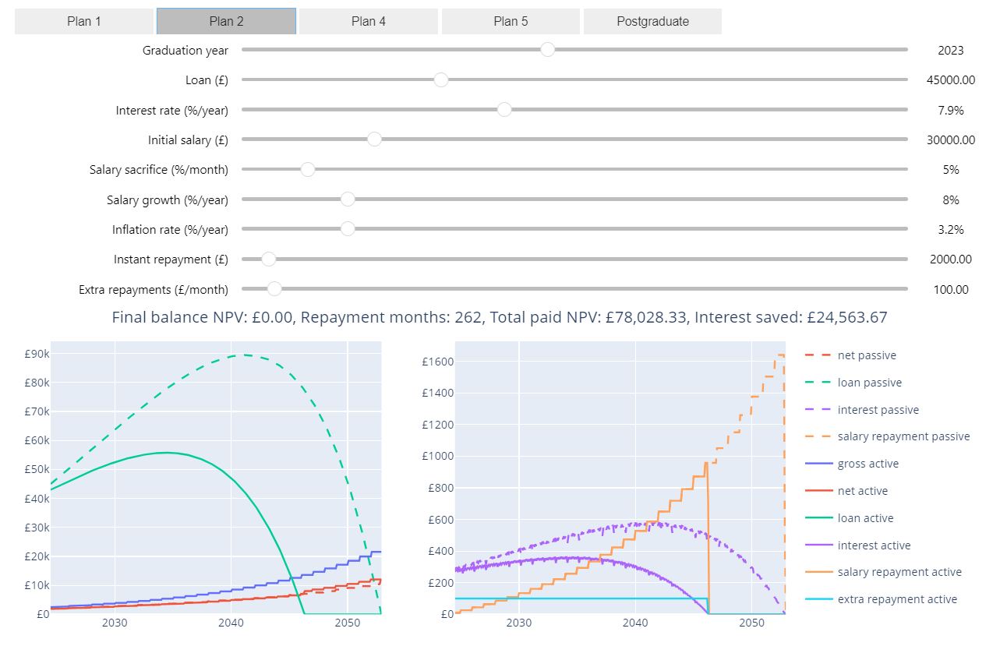
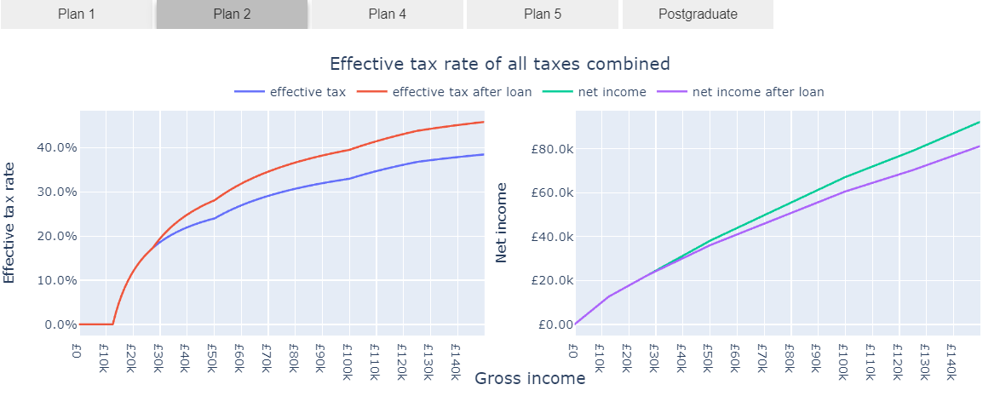

# Personal Finance UK

> :warning: This repository and the outputs of its utilities and notebooks are not financial advice.
> **Make use of this repository at your own risk!**

A collection of utilities and notebooks for analysing your finances.

I found the tools available online to be black boxes that were usually not as configurable as I would have liked.
This is what lead me to create the tools you'll find in this repository.

## Usage

You can either:

- Clone this repo and run the notebooks locally
- Open this repository directly in Google Colab 

## Available Notebooks

### [Student Loan](student_loan.ipynb)

This notebook can be used to estimate:
  - If your student loan will be written off
  - The effects of making extra repayments on your total amount repaid

### [Effective Tax Rate](effective_tax_rate.ipynb)

This notebook can be used to see:
  - How all the tax brackets (including NI) combine to form a single percentage for different gross incomes
  - How your automatic student loan repayments are affecting your net income
